# Streaming Data Processing: Publish Streaming Data into PubSub

En este laboratorio, se simularán datos provenientes de sensores de tráfico y se publicarán en un tópico de Pub/Sub. Estos datos serán procesados en tiempo real por una canalización de Dataflow y finalmente almacenados en una tabla de BigQuery, donde podrán ser analizados posteriormente.

Google Cloud Pub/Sub es un servicio de mensajería en tiempo real totalmente gestionado que permite el intercambio de mensajes entre aplicaciones independientes. Con Pub/Sub, es posible publicar y suscribirse a datos provenientes de múltiples fuentes. Luego, mediante Google Cloud Dataflow, estos datos pueden ser procesados y analizados en tiempo real de forma eficiente y escalable.

## Objetivos
En este laboratorio, realizarás las siguientes tareas:

- Crear un tema y una suscripción de Pub/Sub

- Simule los datos de sus sensores de tráfico en Pub/Sub.


#
# Laboratorio


# Tarea 1 - Preparación

Ejecutarás un simulador de sensores desde la máquina virtual proporcionada para el entrenamiento. Para ello, será necesario configurar el entorno adecuadamente y contar con varios archivos requeridos para la simulación.

1. haga clic en **Compute Engine > Instancias de VM .**

2. Localice la línea con la instancia llamada **training-vm .**

    
3. En el extremo derecho, en Conectar , haga clic en **SSH** para abrir una ventana de terminal.

4. En este laboratorio, ingresará comandos en la máquina virtual de entrenamiento **training-vm.** .

### Verificar que la inicialización esté completa.
La máquina virtual de entrenamiento **training-vm** está instalando software en segundo plano. Verifique que la configuración esté completa revisando el contenido del nuevo directorio:
```
ls /training
```
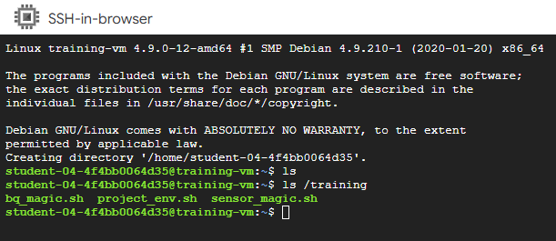

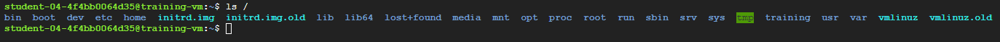
### Descargar el repositorio de código
Como siguiente paso, descargá el repositorio que contiene los archivos necesarios para ejecutar el simulador y completar el laboratorio:
```
git clone https://github.com/GoogleCloudPlatform/training-data-analyst
```
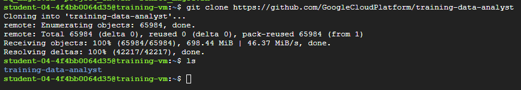
### Identificar el proyecto
Una de las variables de entorno que deberás configurar es `$DEVSHELL_PROJECT_ID`, la cual almacena el ID del proyecto de Google Cloud necesario para acceder a los recursos facturables.

Para identificar el ID del proyecto:

1. En la consola de Google Cloud, abrí el **Navigation menu** y hacé clic en **Home**.

En el panel de información del proyecto, verás el **ID del proyecto.**
También podés encontrar esta información en la pestaña Qwiklabs, dentro de Detalles de conexión, bajo el nombre **GCP Project ID**.

2. Una vez identificado el ID, abrí la terminal **SSH** de la máquina virtual de entrenamiento **training-vm** y ejecutá el siguiente comando para configurar la variable de entorno y exportarla, de modo que esté disponible para otros shells:
```
export DEVSHELL_PROJECT_ID=$(gcloud config get-value project)
```
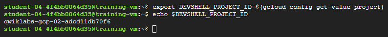
#
# Tarea 2 - Crear un topico y una suscripción de Pub/Sub.


1. En la terminal SSH de **training-vm** , navegue hasta el directorio de este laboratorio:

 ```
cd ~/training-data-analyst/courses/streaming/publish
```
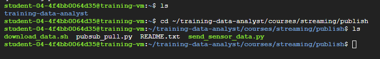
### Verifique que el servicio Pub/Sub sea accesible y funcione mediante el comando gcloud.

2. Crea tu topico y publica un mensaje sencillo:
```
gcloud pubsub topics create sandiego
 ```
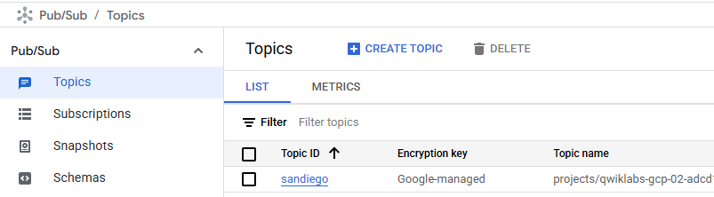


3. Publica un mensaje sencillo:

 ```
gcloud pubsub topics publish sandiego --message "hello"
```
4. Crear una suscripción para el tema:
 ```
gcloud pubsub subscriptions create --topic sandiego mySub1
```
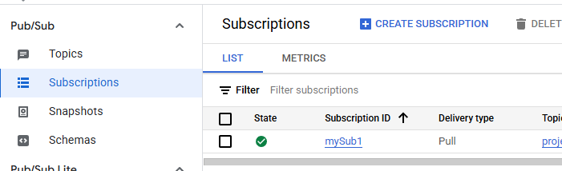


5. Extrae el primer mensaje que se publicó en tu topico:
```
gcloud pubsub subscriptions pull --auto-ack mySub1
```

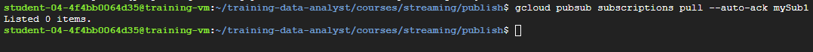

¿Ves algún resultado? Si no, ¿por qué?

No veo ningun mensaje:
```sh
Listed 0 items.
```
significa que no hay mensajes disponibles actualmente en la suscripción **mySub1** de **Pub/Sub** para ser leídos.

La razón principal de esto es que primero publicamos un mensaje en **myTopic1** sin haber creado la subscripcion a dicho Topico.

6. Intente publicar otro mensaje y luego extráigalo usando la suscripción:

```
gcloud pubsub topics publish sandiego --message "hello again"
gcloud pubsub subscriptions pull --auto-ack mySub1
```


¿Recibiste alguna respuesta esta vez?

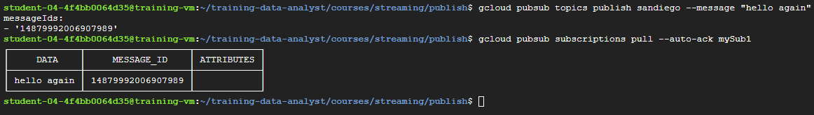

7. En la terminal SSH de training-vm , cancele su suscripción:    
```bash
gcloud pubsub subscriptions delete mySub1
```

#

# Tarea 3 - Simular datos de sensores de tráfico en Pub/Sub.

1. Explora el script de Python para simular los datos del sensor de tráfico de San Diego. **No modifiques el código.**
```
cd ~/training-data-analyst/courses/streaming/publish
nano send_sensor_data.py
```
Observa la función de simulación. Esta permite que el script se comporte como si los sensores de tráfico enviaran datos en tiempo real a Pub/Sub. El parámetro `speedFactor` determina la velocidad de la simulación. Sal del archivo presionando **Ctrl+X .**

2. Ejecutá un script llamado `download_data.sh` que está en el directorio actual.:
```
./download_data.sh
```

### Simular la transmisión de datos de sensores

3. Ejecute send_sensor_data.py :

```
./send_sensor_data.py --speedFactor=60 --project $DEVSHELL_PROJECT_ID
```


Este comando simula los datos del sensor enviando datos registrados mediante mensajes **Pub/Sub**. El script extrae la hora original de los datos del sensor y pausa el envío de cada mensaje para simular una sincronización realista. El valor `speedFactor` cambia proporcionalmente la sincronización entre mensajes. Por lo tanto, un `speedFactor` de 60 significa "60 veces más rápido" que la sincronización registrada. Enviará aproximadamente una hora de datos cada 60 segundos.

**Deje esta terminal abierta y el simulador en ejecución.**


# Tarea 4 - Verificar que se reciban los mensajes.

### **Abra una segunda terminal SSH y conéctese a la máquina virtual de entrenamiento.**
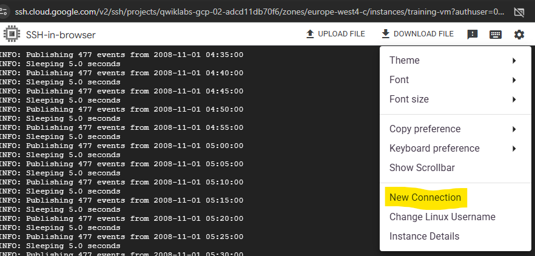
```
cd ~/training-data-analyst/courses/streaming/publish
```
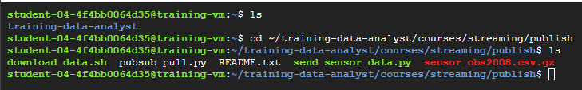
Crea una suscripción para el tema y realiza una extracción para confirmar que llegan los mensajes (nota: es posible que tengas que emitir el comando 'extraer' más de una vez para comenzar a ver los mensajes):

```
gcloud pubsub subscriptions create --topic sandiego mySub2
gcloud pubsub subscriptions pull --auto-ack mySub2
```
Confirme que ve un mensaje con información del sensor de tráfico.
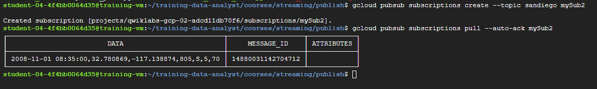
Cancelar esta suscripción:
```
exit
 ```

Cerrar la segunda terminal:
```
exit
 ```
### Detener el simulador de sensores
- Regresar a la primera terminal.
- Interrumpa el editor escribiendo **Ctrl+C** para detenerlo.
- Cerrar la primera terminal:
```
exit
 ```